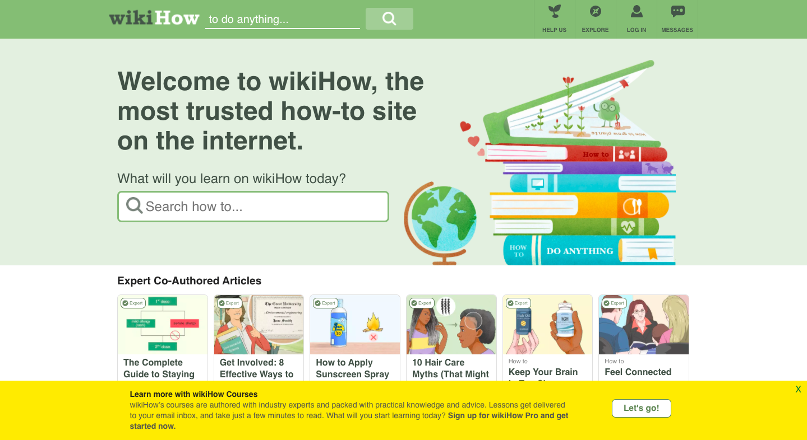

# Bridging Generations: The Intersection of Digital Instruction and Tentative Questions

## Assignment 01: Heuristic Evaluation
__Digital Humanities 110 | Jacqueline "Jackie" Vo__

# Project Description #

*In regards to this specific assignment:*
> This spring quarter's focus in the user interface and design course is on the senior age group. In the pre-class survey, we were asked to view websites that may be of use to the older generation and how the layout may or may not help them naviagate. Since COVID-19 has put many of us in quarantine, I decided to look into instructional websites. I will be examining wikiHow and Dummies because of their virtually automatic appearance on the web; they have created instructions for a variety of topics. They also appear near the top of many search results.

> By improving the UX design, the sites would be able to better inform those seeking online instructions. With this adjusted, the projected result is that seniors will be able to reclaim that youthful feeling of being able to figure out problems and do various projects on their own. 

*The project as a whole:*
>   My project is meant to be exist at the intersection of digital instruction with traditional art. In other words, I am taking what we know as a technologically progressive generation and appealing to older age groups with something that they are more used to—they alreeady know about those greeting cards. Now they are able to get creative with their written sentiments! Through a series of assignemnts, I will relay the positive effects of technology and find ways to make information more accessible. Inclusive spaces will overlook people of all age groups and even their technological abilities.

> Since we are expected to eventually produce something physicial, I felt that cards right now have developed in more creative regards. With the UX design of this website adjusted, seniors would better be able to make more exciting greeting cards and use what they know (traditional mailing) to reach loved ones from a safe distance. In order to get to this point, websites need to undergo improvements to make the process as easy as possible.

## __Website 01: [wikiHow](https://www.wikihow.com/Main-Page)__ ##

**Basic Information:**
> *wikiHow is a database of how-to-guides that consist of step-by-step instructions. These are often consisted of still images and even animated images. The site is an open source that is often found at the top of search results. The site's most popular article is "How to Take a Screenshot in Microsoft Windows," showing that the site is geared to help answer random questions through visuals and instructions. It is an open and free source that allows people tto edit pages and articles.*

**Pre-Heuristic Evaluation:**

Most of the articles follow a format of listing the steps, tips, warnings, (if applicable) and materials. At the bottom of the page, there is a Q&A to ask those in the community questions about the article/guide, a tip submission option, and a checklist so that people are able to gather their matierals. At a glance, I think that because the website has so much content to offer, sections and topics should be better emphasized. The home page feels almost overwhelming to look at because of the list of tending articles and articles that have been created by an "expert." Although this is helpful, the drawback is that the content overload might not be relevant to the individual user. On the mobile application, all of these articles do not follow the desktop version's gridlike template and instead, is shown as an endless scroll of articles. 

# Usability Problems: Severity Scale #
**Rating** | **Description** 
-----------|--------------------
1 | This is not seen as a usability problem at this time.
2 | Minor usability problem, this is less of a priority to fix.
3 | Major usability problem, this is the top priority to fix.

**The Heuristic Evaluation:**

**Usability Heuristic** | **wikiHow Evaluation** | **Severity Rating** | **Comments for Improvement**
--------------------|--------------------|-----------------------------|--------------------
**Visibility of system status**: Timely feedback upon interaction. Users should know that their site is properly functioning. | **Good:** The page loads immediately and has no special effects like fade-ins or outs. Upon hovering over buttons, a drop list of options appear, and the title of how-to articles turn blue when the cursor hovers over it to indicate that there is a hyperlink attached. Everything seems to function as soon as the user interacts with the site. **Bad:** The search bar does not have a drop down of article suggestions when the user is typing. This dropdown list is seen on various sites such as Google, YouTube, and even Dummies. Since suggestions are such a common function, I questioned if the site was processing my search or not. | 2 | **Critique:** It's not a big issue but wikiHow would be more helpful if it had the predicted text feature. Not only does that provide a shortcut for some users, it also has the potential to list topics similar to the one at hand.
**Match between system and real world**: Familiar language and symbols to overcome the initial introduction to a new site. | **Good**: Most of the symbols are self explanatory. bad. The search bar has a magnifying glass, the edit tool is indicated by a pencil, the profile and login page are indicated with an minimalist person. **Bad:** A questionable symbol that is on the site is a tab that is labeled "HELP US" and it is represented by a tree. I was a bit confused until I hovered over that button. My biggest criticism here is that in order to see those symbols, the user would have to scroll all the way up for the symbols to appear. At a glance, I would think that I could only search up articles or explore what was given to me on the home page. This is because even when that tool bar loads, when I scroll down, it disappears. | 3 | **Critique:** I think that the "HELP US" can be changed to a plus "+" sign because the droplist that comes with it offers users a chance to write an article, request articles, and a page of categories. The plus symbol is more reflective of their "etcetera" page. In addition to this, users should not have to scroll all the way to the top for the tool bar to appear. It should just be consistent in accessibility because it is tedious to have to scroll to the top to access personalized tools like the user's profile, messages, and exploration page.
**User control and freedom**: Prevention and ease of misclicks and frustration. Does this site have an "emergency exit"? Options like undo, redo, etc. | **Good:** The header and footer of the site are consistent in the sense that is always availible for users. Upon clicking the title of the site, users are able to return to the homepage. The footer has extensive navigation options and explicitl list the home page, and about page, a site map, and so on. | 1 | **No critiques:** I like how the footer has the site map and other options explicitly listed. It follows the format of other websites and is helpful to those who scrolled until the end. It's less overwhelming than putting everthing in the header. In addition to this, wikiHow did very well to list categories and subcatergories at the bottom. For instance, the how-to make a card page indicated the following: Categories -> Holidays and Traditions -> Birthdays -> Birthday Cards. With these, users are able to return to the previous subcategories. So if someone no longer wanted to make a birthday card, they could go look at other projects involving birthdays. 
**Consistency and standards**: Consistent design and usage across the site. | Good: Everything about this site is consistent. There is a strict alternating color scheme of dark gray, light gray, green, white, and yellow. There colors are easy on the eyes and the format both visually and how it is published is the same. Users can always expct the same style of the dropboxes, the step-by-step instructions, etc. | 1 | **No critique:** Even the artwork across the site feels like it was done by a single artist. It follows a simple and semi-realistic depiction since most of the art assists in tasks that take place in the real world. 
**Error prevention** Provide safety nets for the user. Consider options like confirming an action. | **Good**: There are pop-up boxes that will provide warnings and disclaimers about updating an article, bookmarking an article, and regarding the checklist option, users can mark and unmark their checklist with ease. Submissions such as questions and tips are also reveiwed before being published to keep content appropriate. For pop up boxes like the sign in box, users are also able to click cancel and still explore as an unregistered user. | 1 | **Critique:** Considering that most users will use this website as a how-to guide, there are not many "safety nets" required. If the user tries to initiate a process that cannot be done, red text will appear to indicate the error. The text will also tell users what is required of them. For example, in order to reset a user's password, they need to provide their username and email address. If they do not provide that and click submit, the website will say that both of the items were not provided. In other words, in the case of an errorm the website tells you exactly what you need to do to fix the problem.
**Recognition rather than recall**: Suggestions or context in actions. Options and information required for easy usability. | **Bad:** Just like mentioned in the first heuristic, the search bar does not follow the standard drop down of article suggestions when the user is typing. It only shows up once the user has searched for it. This is a problem because most of the time, if someone already knows or learned how to do something, the chances of them revisitng the article is low. | 3 | **Critique:** In addition to the droplist/text predictability option for the search bar, wikiHow could improve their website by suggesting articles related to your previous search. For instance, if someone were to look up how to make a greeting card, maybe the site could suggest other arts and craft ideas. Filters for searches within different categories would also be good for those who might use words that are applicable across mulltiple topics.
**Flexibility and efficiency of use**: Is this accessible to both inexperienced and experienced users? | **Good:** General settings are availible at the top of the page and more in depth tools are in the footer of the page. Users do not need to register, indicating that they do not expect consistent involvement with their community. The website is very easy to visit and leave. **Bad:**: Since there is so much potential with their how-to guides, the options and trending articles can be overwhelming for users. It does take awhile to scroll down the site to the footer. | 2 | **Critique:** wikiHow almost performs like Google because it helps answer questions (guiding in tasks). I think that wikiHow should invest more time in reducing the list of options to in the drop boxes. The header looks simple until the droplist provides various options that are not necessarily relevant to narrowing down the person's search.
**Aesthetic and minimalist design**: Design is legible and highlights call to action. There is a balanced look. | **Good:** The artwork is simple enough to be produced in a timely manner and is also realistic enough to assist in tasks that take place in the real world. The images do not clash with the consistent color scheme either. The website is overall, easy to look at. **Bad:**: The home page has a trending articles and popular articles section where the varying titles of the guides (most are longer) make the space look cluttered.  |  2 | **Critique:** Instead of listing trending articles, wikihow should have an overarching image that is able to wordlessly define each category. Categories on the main page would be more helpful if wikiHow does not want to stray too far from thir original design. Another suggestion is that they can completely minimalize it and take after Google's centered search bar. This website is specific to how-to guides and can be seen as the Google of tutorials! Google still has their headers with their options so it isn't too minimalist.
**Helps users with errors**: Have an indivator about an error and give information on how to fix it moving forward. | **Bad:** There are no error indicators that I can find. In the search bar, I typed random letters and numbers to see if wikiHow would suggest me an article or let me know that what I typed was not helpful for their search. wikiHow just navigates me to search results that are popular. | 3 | **Critique:** Following Google's "Did you mean:" feature, I think my suggestion here is for wiki to try and see if there is any words or results that they can define.
**Help and documentation**: Have help pages that are easy to understand. FAQs, etc. | **Good:** wikiHow has a section for tips and questions at the end of each tutorial guide. **Bad:**: There is no option for users to leave questions or critiques about the website as a whole. | 2 | **Critique:** There should be an option specific to providing feedback on the website or a communicty chat center (separated by category) so that people can help others in a more timely manner. Extensive FAQ listings might be nice to help answer any potential questions as well.

**Overall Website Severity Rating:** 
> **2**. The website is overall an accessible site with relevant functions. There are some issues that are important to fix but it is still overall a user-friendly site.

## __Website 02: [Dummies](https://www.dummies.com/)__ ##

**Basic Information:**
> *Dummies or For Dummies is a series of instructional guides. Dummies is best known for their distinctive books that are in the colors yellow and back. Their intention is to cover various topics and break down information that may appear to be intimidating for beginniners. The website itself sports the same colors and a search bar that takes up most of the home page. Just like wikiHow, it is an open source.

**Pre-Heuristic Evaluation:**

The website is very organized for a source that is meant to be extensive guides to to various topics. The text is white and bold for titles and tabs. The color yellow is engaging and their way of indicating an important button. Right on the home page, the two buttons/words in yellows is "SEARCH" and "Activate Now." Most of the guides follow the same format with their warnings and required materials. The bottom of the page has the footer with contact options and disclaimers. At a glance, this webstie looks like a website that is much more organized in terms of their categorization. Instead of popular articles, Dummies appears to be a site that is user oriented. Below the search bar on their home page, Dummies has a section that is labeled "Select a category you want to learn more about." In addition to this, the various categories feel less overwhelming than wikiHow and does not feel like clutter. Their mobile site and desktop site both have images and symbols that are representative of the topics.

# Usability Problems: Severity Scale #
**Rating** | **Description** 
-----------|--------------------
1 | This is not seen as a usability problem at this time.
2 | Minor usability problem, this is less of a priority to fix.
3 | Major usability problem, this is the top priority to fix.

**The Heuristic Evaluation:**

**Usability Heuristic** | **Dummies Evaluation** | **Severity Rating** | **Comments**
--------------------|----------------------------|---------------------|----------
**Visibility of system status**: Timely feedback upon interaction. Users should know that their site is properly functioning. | **Good:** The page has no special effects and gives the information that users are looking for. Since the buttons and text is placed over the image, hovering over the navigation makes a black box appear. This further indicates that there is a button to be clicked/there is a hyperlink attached. The titles of the categories also shift slightly in place when the mouse hovers over it. There is also a yellow loading circle when the article or page takes a bit longer to load. | 1 | **No critiques:** I like the feel of this site. It feels like they really appreciated the minimalist aspect because just as their mission statement does, I did not feel overwhelmed at all when going through their home page. 
**Match between system and real world**: Familiar language and symbols to overcome the initial introduction to a new site. | **Good**: The symbols and images are all relevant to each category. The search bar sports the usual magnifying glass and for the amount of categories they have, their symbols all give users a good idea of what the topic is. | 1 | **No critiques:** This hheuristic is completely satisfied, in my opinion. There is no questionable jargon or symbols/images that feel out of place.
**User control and freedom**: Prevention and ease of misclicks and frustration. Does this site have an "emergency exit"? Options like undo, redo, etc. | **Good:** In each tutorial, they have indicators for the topic. So if the user is making a card, they'll see: A house for the home button followed by Crafts / Holiday Crafts / How to make a Multilayered Pop-Up Christmas Card. The catergoies and their subcategories are all differentiated with the "/" slash. If users wanted to return to their previous page or return to the homepage altogether, the option is at the very beginning of the guide. | 1 | **No critiques:** I noticed that wikiHow did something similar. It is very helpful to explicitly list the catfoeis like that. This helps users feel more in control of the topics they are looking into and can potentially narrow their search.
**Consistency and standards**: Consistent design and usage across the site. | **Good:** The site is concsitent in the color scheme and is visually accessible. The text itself uses vocabulary that is understandable and the site is even offered in different languages. They use numerical orders of the tutorial steps and those numbers are yellow with black boxes. The background is white so it is easy to read in that sense. **Bad:** There is not much artwork across the guides and when there are, the images resemble instruction manuals. It is not so engaging and the guides rely on heavy blocks of text.  | 3 | **Critique:** If they want to keep the images minimalistic, they should consider GIF images. The animation would help bring life to the website and compliment it's advanced yet simplistic take on tutorial guides. It would also be nice to read less and see more visuals. Some articles don't even have visuals at all. Visuals are important because even if the user is not experiencing that specific scenario, the information provided is given more context.
**Error prevention**: Provide safety nets for the user. Consider options like confirming an action. | **Good:** Instead of asking the user if they are sure about clicking an article, Dummies opens up a new tab for the user. This is generally a good example of error prevention because the user could just close the tab. They do not lose progress from their previous page. |  1 | **Critique:** If someone fills out a form to contact Dummies or something that users manually input, Dummies will let them know in red text about the information they are missing and/or which fields are required. 
**Recognition rather than recall**: Suggestions or context in actions. Options and information required for easy usability. | **Good:** The search bar has text prediction when users are typing in their article/question. Tabs are self-explanatory. The main ones are as follows: Browse Topics, Dummies on Amazon, and Custom Solutions. These do not require further explanation and go right to the point. | 1 | **No critique:** Text prediction and the organization of categories helps the user narrow down their search. This doesn't need to change but a quick note: It would be cool to see a search filter in case users to not want to see certain categories/have that appear in their results.
**Flexibility and efficiency of use**: Is this accessible to both inexperienced and experienced users? | **Good:** All general settings are in the header and are consistent in visbility and accessibility. Users do not have to register to access the guides so users can come and go as they please. This website is user-oriented to one-time visitor and regular visitors alike. **Bad:** Their tutorials have a lot of text and sometimes there are not even images to accompany the text. | 3 | **Critique:** Dummies should consider all types of learners in their tutorials. Their tutorials feel more professional because not just anyone can edit it but the problem there is that these experts do not always consider the type of learners that are visiting these articles. Include more images if not an audio that is able to audibly explain the content. The rating here is a 3 because it seems like there is only one type of learner that will be able to reap the most benefits from this site.
**Aesthetic and minimalist design**: Design is legible and highlights call to action. There is a balanced look. | **Good:** From the colors to the tabs and indicators, Dummies has a very clean design. Over their categories and images, if a user hovers their cursor over it, the images and text will react by slightly moving. The website is overall easy to look at in terms of design. **Bad:** The text gets chunky. Since the guides are not in-person, sometimes minimalism needs to be sacrificed so that the tutorial can fulfill its purpose. They should utilize more of their empty space. | 2 | **Critique:** Break up the text with more visual instructions and animation. 
**Helps users with errors**: Have an indivator about an error and give information on how to fix it moving forward. | **Good:** I typed random letters for a search and they will indicate that there are no results found. This suggests that the topic might not be related to the site's guide. **Bad:** Howver, when I purposely typed a typo, the search rsults still came up as no results. | 3 | **Critique:** Just like my suggestion for wikiHow, they should start following Google's "Did you mean:" feature. This will help users find their topic even if they lack proper terminology (they're here to learn, after all!)
**Help and documentation**: Have help pages that are easy to understand. FAQs, etc. | **Good:** They have a contact us option. **Bad:** Dummies does not have sections in their tutorial articles for people to ask questions. Sometimes there will be a tip to help with the project but there is no space to ask addtional questions. | 3 | **Critique:** Dummies should consider an option that will allow other experts and learners to discuss. Consider a forumn so that people can get their answers in one place. The contact us option feels tedious for those needing a quick answer. Consider a FAQ section to be required for the articles. If someone is wondering how to do something, it is likely that they will have other questions as well.

**Overall Website Severity Rating:** 
> **2**. The website is overall an accessible site with relevant functions. Despite some improvements and favorable options that wikiHow does not have, Dummies lacks in areas that hurt their statement about being able to make information less intimidating. Sure, their guides are broken down from their books and are not as lengthy as that particular text. However, the lack of visuals and extra assistance can hurt learners that require more direction.

# Assignment 1 Conclusion: #
> *Of the two websites, if I were suggest a resource, I would suggest wikiHow. On top of the textual guide, the visuals are able to reinforce the user's ability to learn. In regards to the class project surrounding the senior age group, I believe that wikiHow would be more helpful with their FAQ and extensive TIPS center.*
