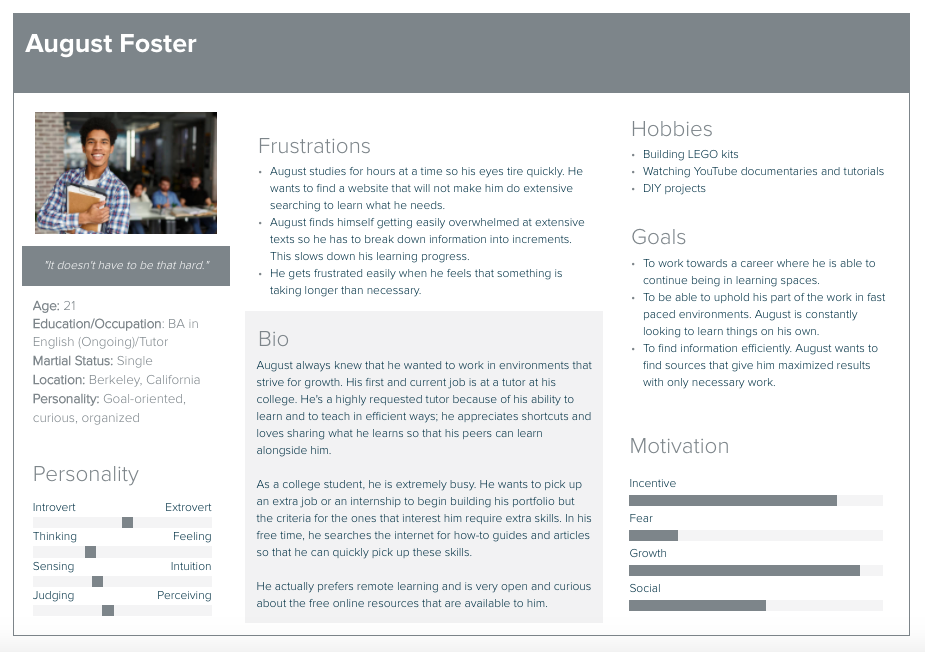
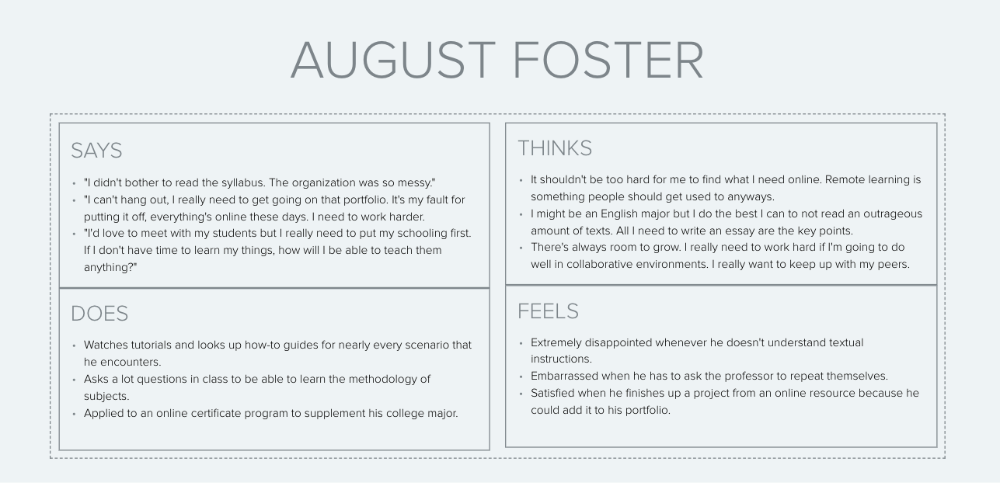
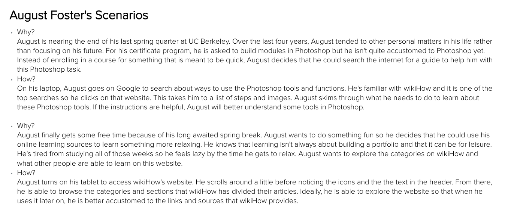
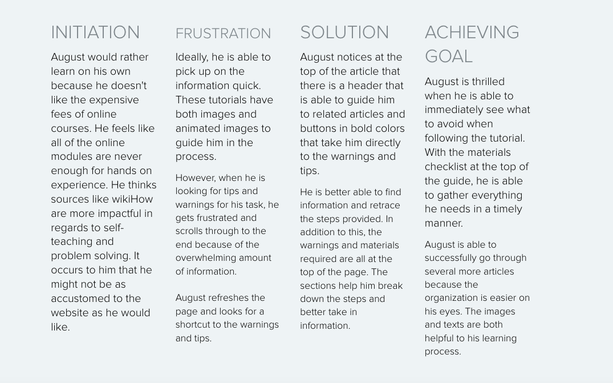
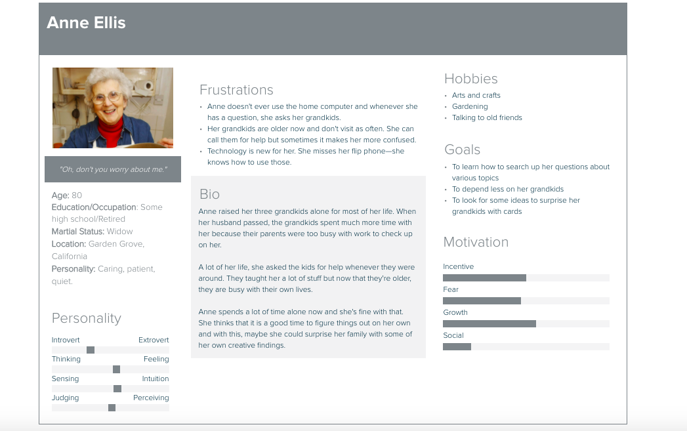
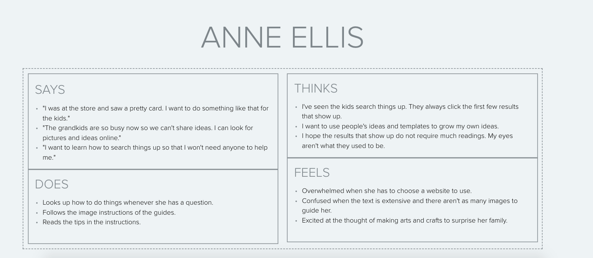
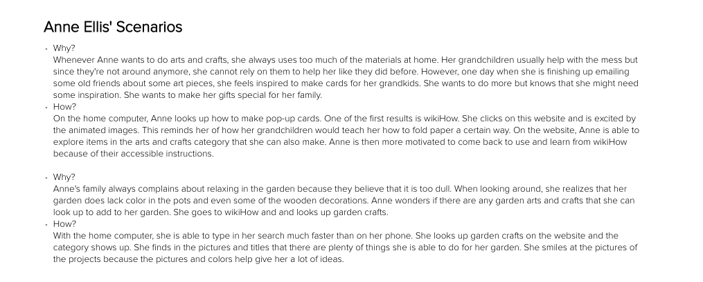
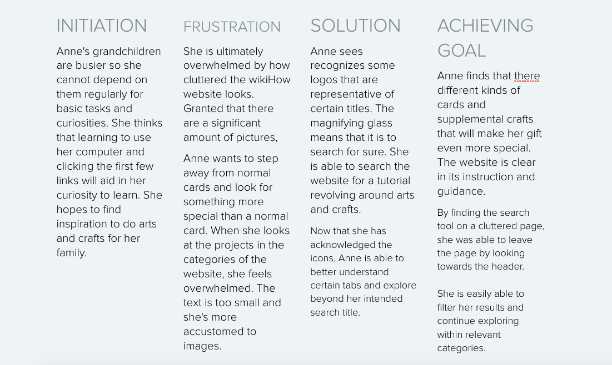

# Bridging Generations: The Intersection of Digital Instruction and Tentative Questions

> *The objective of this assignment is to begin detaching myself towards the website(s) I have been analyzing to understand things from the user's perspective. It is important to gain new insight and things that I have not thought of.*
 
## Assignment 04: Persona + Scenario ##
__Digital Humanities 110 | Jacqueline "Jackie" Vo__

## Project Description ##

**What is the purpose of UX storytelling in this project?**

> The goal of this project is to help people of all ages and technological abilities be able to learn from digital archives through remote instruction. Even before the COVID-19 pandemic, many people were already using remote instruction in their lives. Whether it be a good tutorial on how to fix a leaky faucet or for their creative outlets, digital instruction has been gathered and compressed into websites like wikiHow. 

## UX Storytelling ##

> By utilizing UX storytelling, I will be able to better understand the user's perspective and thus, continue to filter out potential biases and personal points that I may have held onto during the usability testing and the contextual inquiry interview. In addition to this, UX storytelling is able to build upon the data that is gathered from these interviews by pushes the focus onto the user. These methods are meant to be user-centered and a user's experience goes beyond their interaction with a website or program's design. Furthermore, by developing personas and scenarios for this project, I would be able to visualize how to best help various users. Putting the user's thoughts and goals into perspective will help highlight potential problems with the website and program. Through this, I can better empathize with their personalized stories. 

## Improving wikiHow  ##
After identifying some key points using user research derived from interviews and tests, here are two features from the how-to archive that can be improved.
* Header Information
  * The header has icons that are helpful in aiding users who are more visually oriented. Users shouldn't have to scroll a certain way to view icons on the header because those buttons lead to prominent parts of the website.
* Informational Section
  * Each how-to article has a section that contains navigation links to the steps, questions and answers, tips and warnings, and even a list of materials that the users might need. Although it upholds wikiHow's color scheme, it would help for users to find these links right away. Content such as "Tips and Warnings" and "Things You'll Need" are more essential and should be placed at the forefront of the article rather than later in the guide.

During the contextual inquiry, the user was best oriented when websites had primary features and functions as visible buttons or in the header. They were also quick to skim websites to look for materials and tips since they wanted to gather information in an efficient manner.

## Persona 1: August Foster ##

## Persona 1: Anne Ellis ##

