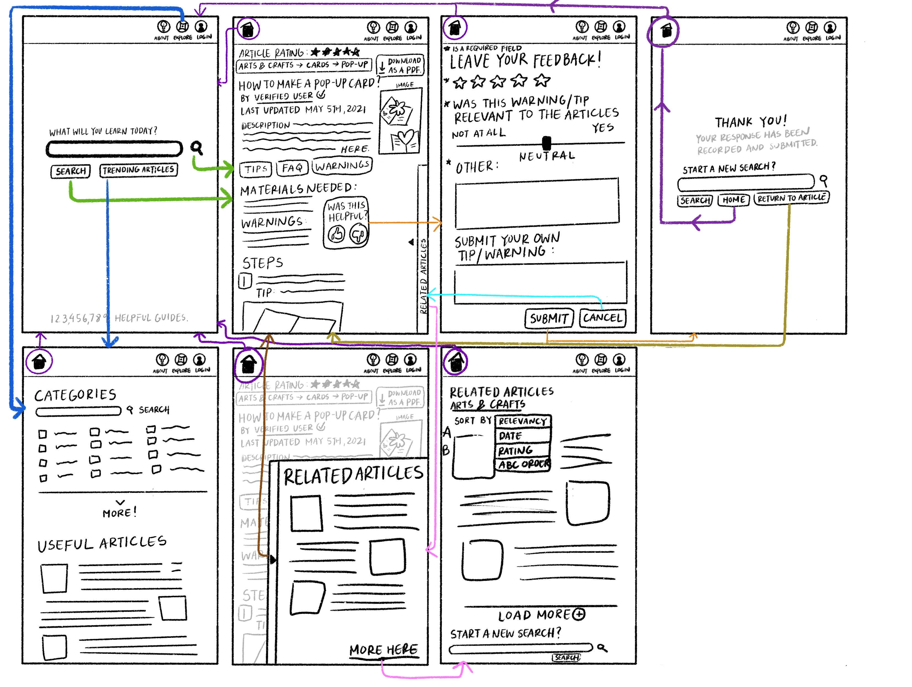
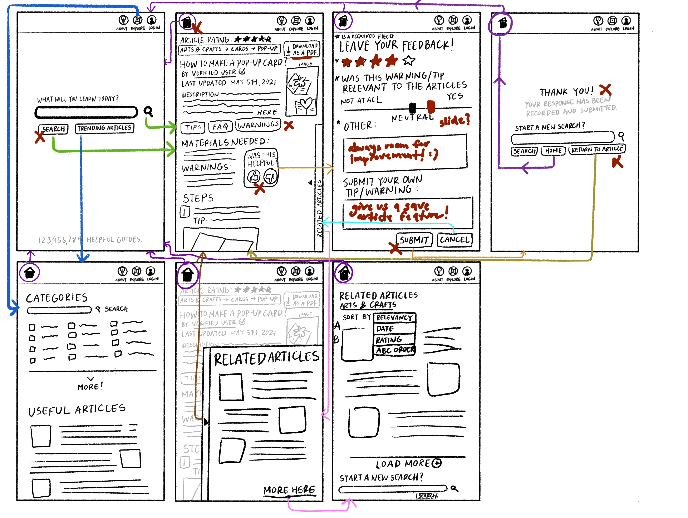
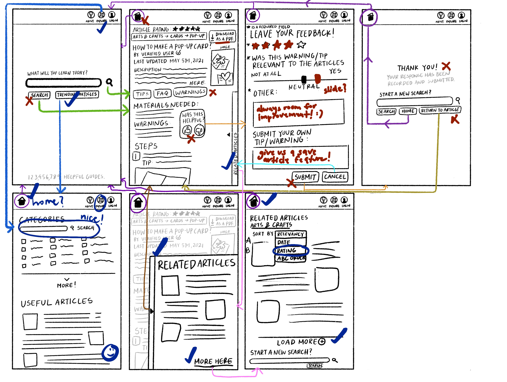
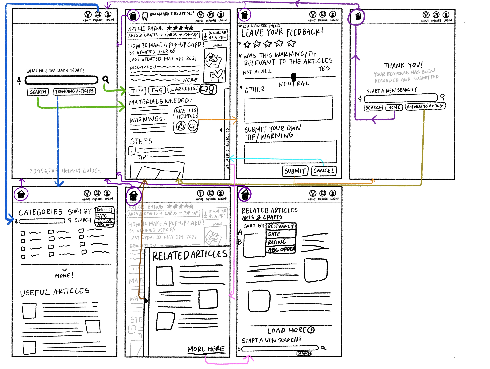

# Bridging Generations: The Intersection of Digital Instruction and Tentative Questions
## Assignment 05: Low Fidelity Prototype ##
__Digital Humanities 110 | Jacqueline "Jackie" Vo__

## Project Description ##
**What is the purpose of this low-fidelity prototyping?**
> This project is looking to solve user difficulties when searching online for how-to guides in their day-to-day tasks. The target community is anyone looking to self-teach and learn. These users are people who prefer to look for solutions to their projects in an efficient and clear manner. Based on user research from previous assignemnets, the following features are meant to solve the overcomplicated guides that may be found on the internet. 

* **Minimalist Design**: To help users not feel so overwhelmed at the search results.
* **Recommendation Feature**: Takes into account the category of the search to suggest related articles for more specific guides. This feature will probably me a pull-out tab so it does not distract from the main article. 
* **Informational Section**: Content such as "Tips and Warnings" and "Things You'll Need" are more essential and should be emphasized. If strategically placed, users will be able to feel more confident and/or better gauge their capabilities before pursuing the project. *See next feature*: Users will be able to rate and critique content like materials, warnings, and even tips.
* **Ratings**: Articles are rated based on their concise and clear instructions. Think of an "upvote" on Reddit. With this, users will also be able to rate parts of the article and submit their own comments for improvement.

> Target users value efficiency and clarity when going through their how-to guides. In this project, the prototyping will be for the user's mobile experience with the site. User personas were created based on the premise of each individual's willingness to learn on their own for adequate solutions. While one user persona was a college student looking to maximize his time during remote learning, the other user persona needed to learn on her own so that she wouldn't have to depend on her family. 

> The purpose of this low-fidelity prototype is to test how these features are able to flow and function in this earlier readaptation of this how-to website. These prototypes will help see if the features will work for users in a setting that is not imagined. As the designer, I will again be able to watch how my users navigate and feel about my features. In addition to this, it would be a good opportunity for me to ask if there is something that they feel is lacking from the website/mobile application. 

## Tasks ##
> This low fidelity prototype supports the following tasks:
> 1. Searching an article
> 2. Rating an article
> 3. Exploring the categories for the articles
> 4. Filtering articles with users' preferences

## Wireframes and Wireflow (V1 - Before Testing) ##

**Flow Explanation**: The flow is to show what features a user might encounter or look for when searching up how-to articles. There are two main paths that are most relevant to the user. The first one is to go through their intended search and the next one is to explore articles that the site has to offer. For the most relevant flow, the user will click their search and be lead directly to an article. On that page, they will see images, warnings, tips, and so on. The most popular functions on the site should be be here. The article and task is accomplished if the user is fine with leaving the website after. However, if they are unhappy with the content, they are able to submit a rating on any of the sections of the guide. Users are allowed to rate the guide out of five stars, rate their satisfaction with the tips and warnings on a sliding scale, and they have two boxes that are open to any of their critiques and comments. After their submission, they will reach a thank you page and that will give them the option to return to the article or begin a new search.

The second task and pathway is just exploration of the article. If they have no specific search, they can go through the categories of the site and see articles that interest them. This is related ot the "Related Articles" feature so hypotherically speaking, if a user were to go to their standard article, they would find this "Related Articles" feature. From there, they can explore articles within that category. This is all meant to make their learning experience easier and less convoluted. 

**Features Explanation**:
* **Minimalist Design**: The amount of information is overwhelming so the site has pull out tabs and "Read More" features. Users are able to get more content at their own discretion. Something else that is included to keep a minimalist feel is the faded texts. There are details here and there with lower opacity rates so that the eyes know where to focus on. When users click on the pull-out box of related articles, the article behind them fades slightly. 
* **Recommendation Feature**: The recommendation feature is on almost every page in the header. The "Explore" tab is always there because even if users come with a goal in mind, the option to learn more is still there. 
* **Informational Section/Ratings**: On top of allowing users to submit critiques and comments about the articles, users are also able to rate the articles. From the materials to their tips and warnings, this feature is meant to give the users more control. This is projected to help the article be more helpful for others. In addition to this, the ratings data can be used to help sort related articles and filter out articles by the user's preferences. 

## Prototype Testing ##
**User One**

> User One had no intention of exploring articles beyond what they were looking for so they searched up the given article and I asked them for an opinion on the article. I wanted to see if the user would utilize tools and options that were offered at the beginning of the article.

**Confusion or unexpected interaction**: I asked the user to think out loud and they complimented the the way that in each tab, the header was consistent with the same icons. They took longer than expected to skim the article but then scrolled back up to answer the "Was this helpful?" button. They said that because I asked for an opinion, they wanted to be thorough in their examination of the article. They proceeded to the feedback page and complimented the sliding scale. Unlike the fill-in bubbles that express satisfaction, the user felt that they could be more precise with their feelings. After reaching the thank you page, I thought that maybe they'd explore the other articles but instead, they returned to the article before clicking back on the home button to return to the home page.

This user completed the tasks better than I had expected. Their reactions were very realistic considering that most people will find their intended article and leave. They left actual feedback for the prototype as whole in their interaction with the flow as well. They suggested a save article feature. This will be implemented in the second draft of this prototype. 

**User Two**

> User Two was more willing to explore the articles on the website because they had more time. The first ting they did was look at trending articles instead of a direct search. I wanted to see how they would react to my attempts at breaking down information through minimalism. Their task was to explore articles beyond their intended search.

**Confusion or unexpected interaction**: Something that surprised me right away was that this user clicked on "Trending Articles" and then went back to the home page to click "Explore" so that they would see if it would lead them to the same page. Once they did, they clicked saw the more button and told me that they understood the gist of that. This user seemed more curious about how related articles would look on a main article. At first, I thought this user was confused because they went back and forth between the related article and main article frame. They realized that the main article fades a little when they click on related articles and appreciated the emphasis.

This user also completed the tasks very well. They were able to explore other articles beyond their intended how-to guide and seemed very comfortable in how it was presented.

## Reflection ##
I felt that this prototype testing went as expected. The user was successful in being able to understand the wireflow and navigated it with little confusion. There was little to no confusion and much more suggestions or even just excitement about the website. There were some things like my inconsistencies about letting users filter their searches on the exploration page. This feature was only availible on the related articles page! That was something that was pointed out to me by the user. I also think letting two users do different taks help me better understand the two personas that I had created in the previous assignment. While one user only cared for their article, the second was more open to spending more time on the website. Here is the revised prototype:

The tester was confused that the review sort and filter returned to the hotel page when she pressed Done. I plan to correct my error and direct the flow back to the list of sorted reviews. The tester was hesitant and unsure whether they had to select a specific rating to sort through the results. I believe this can be solved through design and color when creating my digital prototype. I plan to make these options checkable through checkboxes which are optional in most design aesthetics. In addition to these changes, while this was not mentioned during user testing, I would draw out the flow for the See More button under flights. I believe it would be easier and more efficient for the user to view these details, if necessary, without leaving the app. I also believe it would be convenient for the user to have the Reset button on the hotel and flight Sort features.
