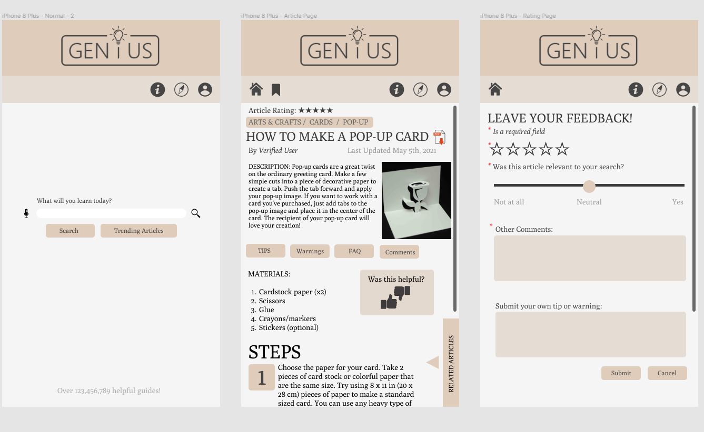
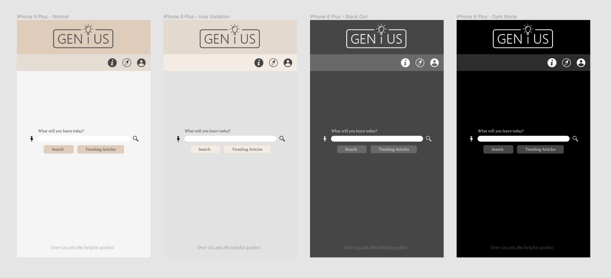
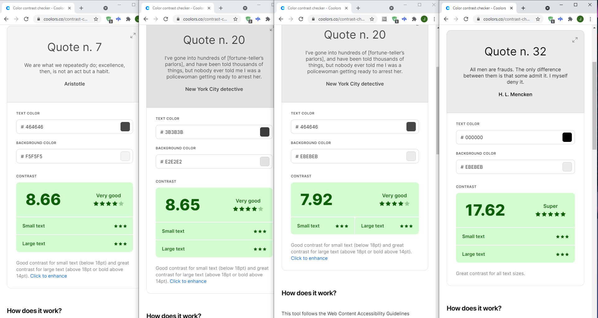

# Bridging Generations: The Intersection of Digital Instruction and Tentative Questions
## Assignment 06: High Fidelity Prototype ##
__Digital Humanities 110 | Jacqueline "Jackie" Vo__

## Project Description, Process, and Purpose ##
**Project Description**
> This project is looking to solve user difficulties when searching online for how-to guides in their day-to-day tasks. The target community is anyone looking to self-teach and learn. These users are people who prefer to look for solutions to their projects in an efficient and clear manner. Based on user research from previous assignments, the following features are meant to solve the overcomplicated guides that may be found on the internet. 

**What is the purpose of this high-fidelity prototyping?**
> The purpose of this high-fidelity prototype is to make the low-fidelity protoype functional. Through user-centered review and improvements, the high-fidelity prototype will be something that users can physically test. This rendition of wikiHow will better organize common tasks that the two developed user personas will need. While one is more goal-oriented and looking to find articles in an efficient manner, the other user persona is looking to explore the application. With these two types of users in mind, the mobile application will ideally be troubleshooting details to make the information less overwhelming to take in.

**What is the process?**
> The interactions and observations made during usability testing and contextual analysis are all included in the making of this prototype. Once user personas were made, wireframes and wireflows were made in the low-fidelity prototype assignment. Based on the feedback from the users that tested that, another low-fidelity prototype was made. From there, those changes were incorporated into this high-fidelity prototype. This interactive prototype was created using Figma with a ideas derived from the wikiHow website. 

## Prototype Tasks ##
This low fidelity prototype supports the following tasks:

* Searching an article.
* Rating an article.
* Exploring the categories for the articles.

## Screen Design (Without Color Variations)  ##
The Figma file could be found [here](https://www.figma.com/file/2h3xAWoXSih0i7QRTDKXSz/Genius-Mobile-Application?node-id=0%3A1).

## Impression Test  ##
The impression test transcript could be found [here](https://docs.google.com/document/d/103CQg9nxzsVbhwDzv_kWiDAVdOh04zAxaPZHEUeuxp4/edit?usp=sharing).

## Summary of Findings ##
> There is always room for improvement. My minimalist take and design was appreciated but I think moving forward, I will look at how more articles are formatted by the mobile view so that I can make my application easier to read for my users. I also think maybe more tabs and links should be added to the article page. The user I tested seemed to be looking specifically for the steps rather than all of the precautions. The links would most likely enable users to click on it. This gives more control to the user. 

> Moving forward, I need to check my wording for things such as the submission button. Users should know that they are about to fill out a longer form rather than just giving the article a thumbs up or down.

## Screen Design (With Color Variations)  ##
The Figma file could be found [here](https://www.figma.com/file/2h3xAWoXSih0i7QRTDKXSz/Genius-Mobile-Application?node-id=0%3A1).
Variations include light-mode, hue variation, dark-mode, and black-out mode.

## Accessibility Color Check  ##
The website I used is here [here](https://coolors.co/contrast-checker/112a46-acc8e5) and follows the following guidelines:
> Web Content Accessibility Guidelines (WCAG). The standard defines two levels of contrast ratio: AA (minimum contrast) and AAA (enhanced contrast).

## Design System  ##
* **Color Scheme**
> For the colors of my day-mode design, I found a color palette by looking up moodboards for academia. Brown tends to invoke feelings of strength and reliability so it was a matter of choosing the shade. I chose a lighter brown so that there would be a contrast to the dark-mode. Not only that, I really wanted the design to feel minimalist and natural. There are no shortcuts to learning so we would *naturally* have to work through classes or in this case, guides, to learn. My background was **#F5F5F5** while my header was had two tones: **#DFCCBB** and **#E5DDD4**. My text was **#3B3B3B** and **#464646** and buttons were consistent to the color of my header. I felt like this all brought the design together. 

* **Iconography**
> I remade stock images of icons in photoshop and illustrator so that it would match the colors on the page. I used gray to contrast to with the light brown and gray. I used universal logos so that they were easily understood. Still, in my next draft, I am considering adding labels anyways. 

> For the logo, I wanted something simple. I thought of the website Dummies and thought about how discouraging being considered a "dummy" could be. So I considered naming my website Genius. The design has the lightbulb to represent ideas. This is all enclosed in a box that is broken by the lightbulb to show that it is good to think outside of the box and seek remote learning. Even if it's not traditional, anyone that is looking to learn should be considered smart or in this case, a genius!

* **Typeface + Size**
> I used a font called Poly since it reminded me of Times New Roman. Poly was sufficient in upholding the academic feeling across the website. It looked clean and had a contrast with the simplicity of the website logo. Test was italicized and had their opacity adjusted accordingly. Some information that I felt wasn't as important or took attention away from the website functions had their opacity turned down. This is seen on the home page. I wanted to show how many guides and how much users are able to learn but still did not want to distract from the search option. This was put at the bottom. 

> In regards to the sizing of the content, I made sure that headings were in all capitals. Playing with the capslock is important for emphasis. I considered lapslock but since that stylistic choice strays away from academic writing, I decided not to. The body text of the articles are size 12 while the other important information was size 14 and above.

> I did my best to mimic wikiHow's font sizes but did not stick to their font choice. Their font looked like Arial and that was something that I did not consider to fit my design's aesthetic. 

* **Layout Grid + Spacing**
> I did my best to follow the instructions on the Google Slides for the layout grid. Luckily, Figma also has the options of locking and unlocking items to scale by their height and width. It is entirely customizable and their rulers also helped me find even spacing between boxes.

> Something else I did was copy and paste elements in the page. It helped with efficiency and consistency. Some parts looked funny even with the rulers so I would eye it myself. Consistency there is key so whenever I made a creative choice, I did my best to keep it consistent on that page. An example is the search page. The buttons were altered in side according to the text. On the article page, the buttons for the TIPS, FAQ, warnings, and comments were all the same size for spacing across the page. Overall, I am satisfied with my choices.

