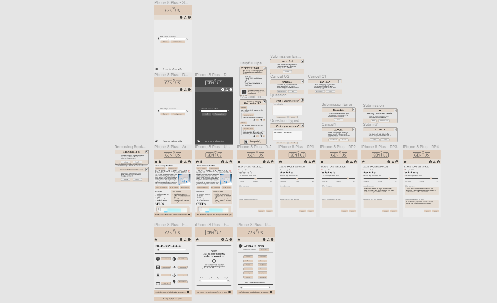
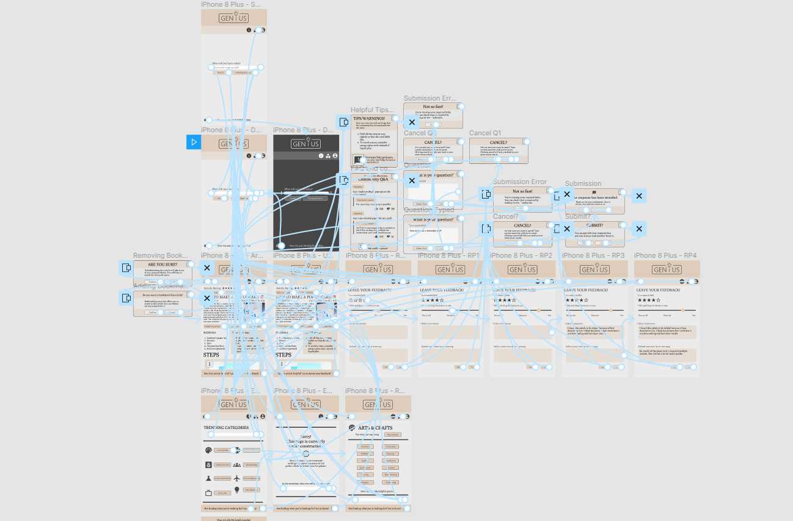

# Bridging Generations: The Intersection of Digital Instruction and Tentative Questions
## Assignment 06: High Fidelity Prototype ##
__Digital Humanities 110 | Jacqueline "Jackie" Vo__

## Project Description, Process, and Purpose ##
**Project Description**
> This project is looking to solve user difficulties when searching online for how-to guides in their day-to-day tasks. The target community is anyone looking to self-teach and learn. These users are people who prefer to look for solutions to their projects in an efficient and clear manner. Based on user research from previous assignments, the following features are meant to solve the overcomplicated guides that may be found on the internet. 

**What is the purpose of this high-fidelity prototyping?**
> The purpose of this high-fidelity prototype is to make the low-fidelity protoype functional. Through user-centered review and improvements, the high-fidelity prototype will be something that users can physically test. This rendition of wikiHow will better organize common tasks that the two developed user personas will need. While one is more goal-oriented and looking to find articles in an efficient manner, the other user persona is looking to explore the application. With these two types of users in mind, the mobile application will ideally be troubleshooting details to make the information less overwhelming to take in.

**What is the process?**
> The interactions and observations made during usability testing and contextual analysis are all included in the making of this prototype. Once user personas were made, wireframes and wireflows were made in the low-fidelity prototype assignment. Based on the feedback from the users that tested that, another low-fidelity prototype was made. From there, those changes were incorporated into this high-fidelity prototype. This interactive prototype was created using Figma with a ideas derived from the wikiHow website. 

## Prototype Tasks ##
This interactive high fidelity prototype supports the following tasks:

* Searching up an article (article is predetermined).
  * Users will be looking up how to make a generic pop-up card.
* Looking into related articles.
  * On top of the exploration page, there will be tab that will let users explore related articles. In this case, the user will be looking at a navigation page that will lead them to other arts and crafts guides.
* Submitting feedback and cancelling the submission.
  * Users will get the chance to submit feedback (fake interaction with established text). There will be required fields but users are also able to cancel their submission. There will be overlays that asks the user if they are sure they are ready to submit, cancel, etc.
* Question submission.
  * When looking through an article, users will be able to see frequently asked questions and also submit there own. This will be a fake interaction with established text. 
* Bookmarking and unbookmarking article(s).
* Checking trending categories to explore the website.
  * This trending categories page is a concept. The working button will be the arts and crafts category. Upon clicking this, they will be revisiting the related articles page.

## How does this follow the created persona and scenarios? ##
The two personas that were made for this project was a younger individual with the drive to learn beyond their schoolwork, while the other persona was meant to help make the website easy to use and accessible for those might not be as technologically inclined. These tasks in this prototype support individuals regardless of their skills in technology. In this revised prototype, I focused more on giving space for user feedback so that users would feel like they are learning remotely and getting their questions answered. 

## Screen Design (Without Color Variations)  ##
The Figma file could be found [here](https://www.figma.com/file/2h3xAWoXSih0i7QRTDKXSz/Genius-Mobile-Application?node-id=0%3A1).

## Impression Test  ##
The impression test transcript could be found [here](https://docs.google.com/document/d/103CQg9nxzsVbhwDzv_kWiDAVdOh04zAxaPZHEUeuxp4/edit?usp=sharing).

## Summary of Findings ##
> There is always room for improvement. My minimalist take and design was appreciated but I think moving forward, I will look at how more articles are formatted by the mobile view so that I can make my application easier to read for my users. I also think maybe more tabs and links should be added to the article page. The user I tested seemed to be looking specifically for the steps rather than all of the precautions. The links would most likely enable users to click on it. This gives more control to the user. 

> Moving forward, I need to check my wording for things such as the submission button. Users should know that they are about to fill out a longer form rather than just giving the article a thumbs up or down.

## Initial Screen Design (With Color Variations)  ##
The Figma file could be found [here](https://www.figma.com/file/2h3xAWoXSih0i7QRTDKXSz/Genius-Mobile-Application?node-id=0%3A1).
Variations include light-mode, hue variation, dark-mode, and black-out mode.

## Accessibility Color Check  ##
The website I used is here [here](https://coolors.co/contrast-checker/112a46-acc8e5) and follows the following guidelines:
> Web Content Accessibility Guidelines (WCAG). The standard defines two levels of contrast ratio: AA (minimum contrast) and AAA (enhanced contrast).

# Revised Prototype #
The cognitive walkthrough script can be found [here](https://docs.google.com/document/d/1-lMW_VNb3fq7VEDDUiUqh9BXR78Q2-ZV09IQk0gXyv8/edit?usp=sharing).
> Questions I considered for my cognitive walkthrough:
* Will my user be able to easily achieve the right outcome?
* Will th icons I picked easily have the user associate things with the correct action?
* Are my tasks something that users will actually value when using my application?

## Design System  ##
* **Color Scheme**
> For the colors of my day-mode design, I found a color palette by looking up moodboards for academia. Brown tends to invoke feelings of strength and reliability so it was a matter of choosing the shade. I chose a lighter brown so that there would be a contrast to the dark-mode. Not only that, I really wanted the design to feel minimalist and natural. There are no shortcuts to learning so we would *naturally* have to work through classes or in this case, guides, to learn. My background was **#EBEBEB** while my header was had two tones: **#DFCCBB** and **#E5DDD4**. My text was **#3B3B3B** and **#464646** and buttons were consistent to the color of my header. I felt like this all brought the design together. 

## Revised Screen Design (Version 2) ##
The Figma prototype could be found [here](https://www.figma.com/proto/RTitlnkgJGe96PjHmSxgjf/Genius-Mobile-Prototype?node-id=8%3A33&scaling=scale-down&page-id=0%3A1).

## Wireflow with Graphic Designs (Version 2) ##
The Figma file could be found [here](https://www.figma.com/file/RTitlnkgJGe96PjHmSxgjf/Genius-Mobile-Prototype?node-id=0%3A1).

* **Iconography**
> I remade stock images of icons in photoshop and illustrator so that it would match the colors on the page. I used gray to contrast to with the light brown and gray. I used universal logos so that they were easily understood. Still, in my next draft, I am considering adding labels anyways. 

> For the logo, I wanted something simple. I thought of the website Dummies and thought about how discouraging being considered a "dummy" could be. So I considered naming my website Genius. The design has the lightbulb to represent ideas. This is all enclosed in a box that is broken by the lightbulb to show that it is good to think outside of the box and seek remote learning. Even if it's not traditional, anyone that is looking to learn should be considered smart or in this case, a genius!

* **Iconography Version 2 (Updated)**
> In the list of resources, I decided to scrap my personally drawn icons and use icons provided in the list. I got my icons from [here](https://fonts.google.com/icons?selected=Material+Icons). Instead of a compass, I chose the shapes for the exploration page so that it would go with the logo and how users are encouraged to think outside the box. Other than that, there are not many icon changes that are not self-explanatory. For instance, I changed the bookmark tab on the article so it would have a plus sign and a check mark. This would better indicate to the user that their article has been saved.

# CHANGES #

The color scheme I decided on was a micture of the variations I provided. While my background was **#EBEBEB**, my header and footer were **#E5DDD4** and **#DFCCBB**. The text was **#3B3B3B**. Whenever I outlined a button, I used **#696969**. I wanted to stick to a brown tone because it felt natural and represented simplicity and dependability. I want the users to feel content when they are looking at my application.

The changes I made from the class impression test can be found from comments [here](https://www.figma.com/file/2h3xAWoXSih0i7QRTDKXSz/Genius-Mobile-Application). There were a lot of comments about fontsize for the homepage and how the "What will you learn today?" should be bigger. I took this into account and went through my whole website considering how a mobile app for a text-heavy website might need bigger fonts. I also took out the texts with lowered opacity because accessibility will always come over aesthetics. The text with the lower opacity struggled during the contrast testing so I made sure that everything was at 100%. I stuck with darker grays and used boxes to keep users visually engaged. 

Figma has an intrinsic line height as the default value (auto) so sizes are rounded to the nearest pixel. My sizes were from 12 px to 24 px. I used 24 px for the title of articles and mostly 12 px for buttons. Other text that I felt was more important than regular text and buttons (buttons are already prominent because of their outline) was sized to 14 px. 

The general layout did not change because the peers that saw my prototype were all sure that my application was some variation of wikiHow. 

* **Typeface + Size**
> I used a font called Poly since it reminded me of Times New Roman. Poly was sufficient in upholding the academic feeling across the website. It looked clean and had a contrast with the simplicity of the website logo. Test was italicized and had their opacity adjusted accordingly. Some information that I felt wasn't as important or took attention away from the website functions had their opacity turned down. This is seen on the home page. I wanted to show how many guides and how much users are able to learn but still did not want to distract from the search option. This was put at the bottom. 

> In regards to the sizing of the content, I made sure that headings were in all capitals. Playing with the capslock is important for emphasis. I considered lapslock but since that stylistic choice strays away from academic writing, I decided not to. The body text of the articles are size 12 while the other important information was size 14 and above.

> Since my application was content heavy, I spaced out the text between each other but utilized as much of the margins as I could.

> I did my best to mimic wikiHow's font sizes but did not stick to their font choice. Their font looked like Arial and that was something that I did not consider to fit my design's vision. 

* **Layout Grid + Spacing**
> I did my best to follow the instructions on the Google Slides for the layout grid. Luckily, Figma also has the options of locking and unlocking items to scale by their height and width. It is entirely customizable and their rulers also helped me find even spacing between boxes.

> Something else I did was copy and paste elements in the page. It helped with efficiency and consistency. Some parts looked funny even with the rulers so I would eye it myself. Consistency there is key so whenever I made a creative choice, I did my best to keep it consistent on that page. An example is the search page. The buttons were altered in side according to the text. On the article page, the buttons for the TIPS, FAQ, warnings, and comments were all the same size for spacing across the page. Overall, I am satisfied with my choices.

## Summary and Reflection ##
Once I got the color scheme down, my biggest obstacle was figuring out the placement of the boxes. It is difficult to try to organize content that has a lot of information. I knew that if I was dealing with something text-heavy, I had to give users a lot of room and chances to give the website feedback. I needed to find a way to make sure that users knew that as a designer, I cared about what they had to say. My favorite part of this was learning about the overlay functions in Figma and making my pages scroll. With pages that scroll, I utilized the still headers and footers to remind users that they can give feedback and ask questions. Every overlay I did had a confirmation box and/or a box that allowed them to close the overlay altogether. It felt like a very real application and the struggles were worth it when I got to hear good feedback and advice from peers and through user walkthroughs and testing.

My changes are noted above but I mostly focused on text size, contrast, and ways to help users understand that remote learning is possible by giving them changes to submit questions and feedback. Overall, I am looking forward to more testing and revisions so that I can further build upon this project.
