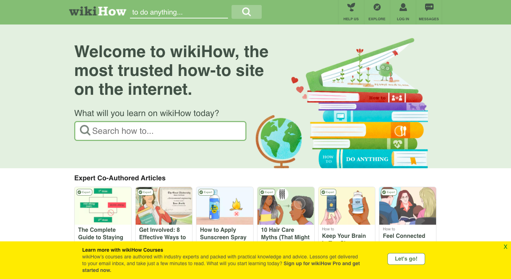
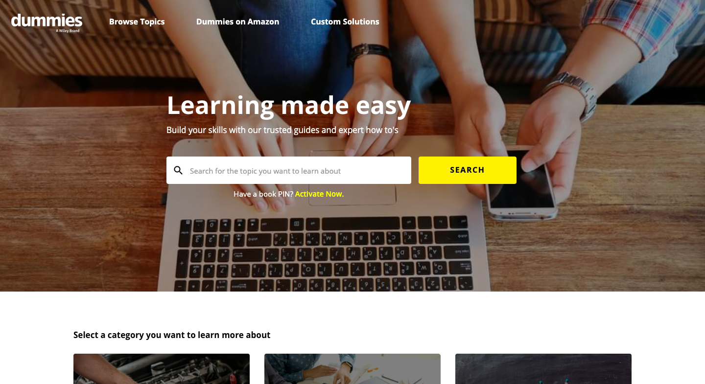

# Bridging Generations: The Intersection of Digital Instruction and Tentative Questions

## Assignment 01: Heuristic Evaluation
__Digital Humanities 110 | Jacqueline "Jackie" Vo__

# Project Description #

*In regards to this specific assignment:*
> This spring quarter's focus in the user interface and design course is focusing on the senior age group. In the pre-class survey, we were asked to view websites that may be of use to the older generation and how the layout may or may not help them naviagate. Since COVID-19 has put many of us in quarantine, I decided to look into instructional websites. I will be examining wikiHow and Dummies because of their virtually automatic appearance on the web; they have created instructions for a variety of topics. They also appear near the top of many search results.

> By improving the UX design, the sites would be able to better inform those seeking online instructions. With this adjusted, the projected result is that seniors will be able to reclaim that youthful feeling of being able to figure out problems and do various projects on their own. 

*The project as a whole:*
>   My project is meant to be exist at the intersection of digital instruction with traditional art. In other words, I am taking what we know as a technologically progressive generation and appealing to older age groups with something that they are more used to—they alreeady know about those greeting cards. Now they are able to get creative with their written sentiments! Through a series of assignemnts, I will relay the positive effects of technology and find ways to make information more accessible. Inclusive spaces will overlook people of all age groups and even their technological abilities.

> Since we are expected to eventually produce something physicial, I felt that cards right now have developed in more creative regards. With the UX design of this website adjusted, seniors would better be able to make more exciting greeting cards and use what they know (traditional mailing) to reach loved ones from a safe distance. In order to get to this point, websites need to undergo improvements to make the process as easy as possible.

# Usability Problems: Severity Scale #
**Rating** | **Description** 
-----------|--------------------
1 | This is not seen as a usability problem at this time.
2 | Minor usability problem, this is less of a priority to fix.
3 | Major usability problem, this is the top priority to fix.

## __Website 01: [wikiHow](https://www.wikihow.com/Main-Page)__ ##

**Basic Information:**
> *wikiHow is a database of how-to-guides that consist of step-by-step instructions. These are often consisted of still images and even animated images. The site is an open source that is often found at the top of search results. The site's most popular article is "How to Take a Screenshot in Microsoft Windows," showing that the site is geared to help answer random questions through visuals and instructions. It is an open and free source that allows people tto edit pages and articles.

**Pre-Heuristic Evaluation:**

Most of the articles follow a format of listing the steps, tips, warnings, (if applicable) and materials. At the bottom of the page, there is a Q&A to ask those in the community questions about the article/guide, a tip submission option, and a checklist so that people are able to gather their matierals. At a glance, I think that because the website has so much content to offer, sections and topics should be better emphasized. The home page feels almost overwhelming to look at because of the list of tending articles and articles that have been created by an "expert." Although this is helpful, the drawback is that the content overload might not be relevant to the individual user. On the movile application, all of these articles do not follow the desktop version's gridlike template and instead, is shown as an endless scroll of articles. 

**The Heuristic Evaluation:**

**Usability Heuristic** | **wikiHow Evaluation** | **Comments for Improvement**
--------------------|--------------------|----------
**Visibility of system status**: Timely feedback upon interaction. Users should know that their site is properly functioning. | **Good:** The page loads immediately and has no special effects like fade-ins or outs. Upon hovering over buttons, a drop list of options appear, and the title of how-to articles turn blue when the cursor hovers over it to indicate that there is a hyperlink attached. Everything seems to function as soon as the user interacts with the site. **Bad:** The searchbar does not have a drop down of article suggestions when the user is typing. This dropdown list is seen on various sites such as Google, YouTube, and even dummies. Since suggestions are such a common function, I questioned if the site was processing my search or not. | 1 | Critique: It's not a big issue but wikiHow would be more helpful if it had the predicted text feature. Not only does that provide a shortcut for some users, it also has the potential to list topics similar to the one at hand.
**Match between system and real world** | Good, bad. | 1-3 | Critique:
**User control and freedom** | Good, bad. |  1-3 | Critique:
**Consistency and standards** | Good, bad. |  1-3 | Critique:
**Error prevention** | Good, bad. |  1-3 | Critique:
**Recognition rather than recall** | Good, bad. |  1-3 | Critique:
**Flexibility and efficiency of use** | Good, bad. |  1-3 | Critique:
**Aesthetic and minimalist design** | Good, bad. |  1-3 | Critique:
**Helps users with errors** | Good, bad. |  1-3 | Critique:
**Help and documentation** | Good, bad. |  1-3 | Critique:

## __Website 02: [Dummies](https://www.dummies.com/)__ ##

**Basic Information:**

**Pre-Heuristic Evaluation:**

**The Heuristic Evaluation:**

**Usability Heuristic** | **Dummies Evaluation** | **Severity Rating** | **Comments**
--------------------|----------------------------|---------------------|----------
**Visibility of system status** | Good, bad. | 1-3 | Critique:
**Match between system and real world** | Good, bad. | 1-3 | Critique:
**User control and freedom** | Good, bad. |  1-3 | Critique:
**Consistency and standards** | Good, bad. |  1-3 | Critique:
**Error prevention** | Good, bad. |  1-3 | Critique:
**Recognition rather than recall** | Good, bad. |  1-3 | Critique:
**Flexibility and efficiency of use** | Good, bad. |  1-3 | Critique:
**Aesthetic and minimalist design** | Good, bad. |  1-3 | Critique:
**Helps users with errors** | Good, bad. |  1-3 | Critique:
**Help and documentation** | Good, bad. |  1-3 | Critique:
